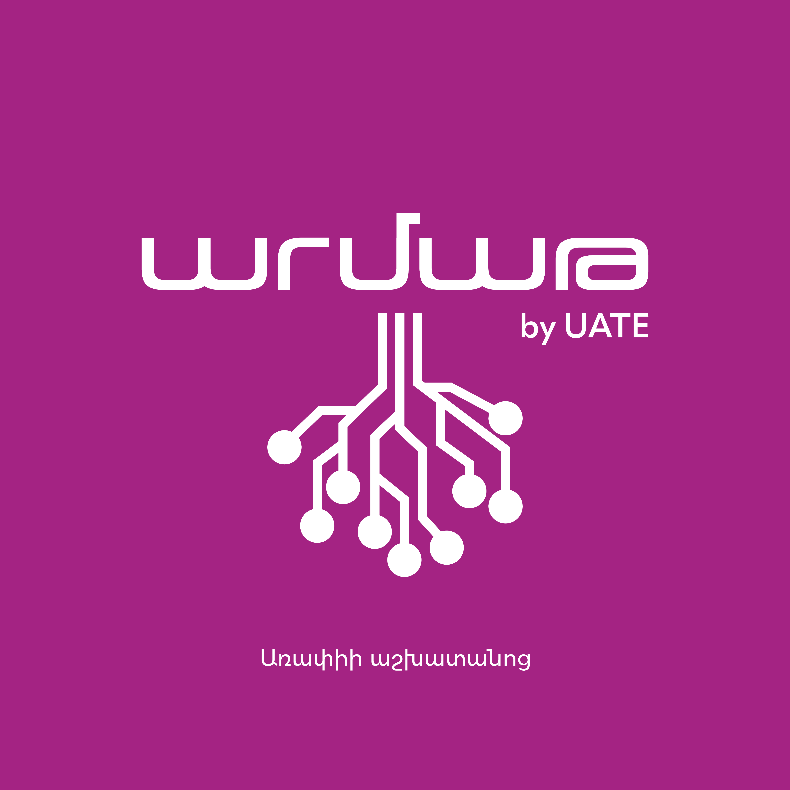

# Armath Arapi Engineering Makerspace

**A state-of-the-art makerspace where engineers, makers, and innovators come together to create, learn, and transform ideas into reality.**

[Live Demo](https://armatharapi.vercel.app) · [Report Bug](https://github.com/GrishaKh/ArmathArapi-website/issues) · [Request Feature](https://github.com/GrishaKh/ArmathArapi-website/issues)

---

## About The Project

Armath Arapi is an engineering makerspace located in Arapi, Armenia. This website serves as the digital hub for our community, showcasing student projects, events, and providing a platform for new students to join our programs.

### Key Features

- **Bilingual Support** - Full Armenian (Հայերեն) and English language support
- **Student Projects Gallery** - Showcase of innovative projects built by our students
- **Events & Achievements** - Documentation of competitions, workshops, and camps
- **Online Applications** - Student enrollment and support request forms
- **Admin Dashboard** - Manage submissions and track applications
- **Responsive Design** - Optimized for all devices

---

## Tech Stack

| Category | Technology |
|----------|------------|
| Framework | Next.js 15 (App Router) |
| Language | TypeScript 5 |
| Styling | Tailwind CSS 3 |
| UI Components | Radix UI + shadcn/ui |
| Animations | Framer Motion 11 |
| Content | Contentlayer (MDX) |
| Database | Supabase (PostgreSQL) |
| Email | Resend |
| Validation | Zod |
| Deployment | Vercel |

---

## Getting Started

### Prerequisites

- Node.js 18+
- pnpm (recommended) or npm

### Installation

1. **Clone the repository**
   \`\`\`bash
   git clone https://github.com/GrishaKh/ArmathArapi-website.git
   cd ArmathArapi-website
   \`\`\`

2. **Install dependencies**
   \`\`\`bash
   pnpm install
   \`\`\`

3. **Set up environment variables**
   \`\`\`bash
   cp .env.example .env.local
   \`\`\`
   
   Fill in the required values:
   \`\`\`env
   NEXT_PUBLIC_SUPABASE_URL=your_supabase_url
   NEXT_PUBLIC_SUPABASE_ANON_KEY=your_supabase_anon_key
   SUPABASE_SERVICE_ROLE_KEY=your_service_role_key
   RESEND_API_KEY=your_resend_api_key
   ADMIN_EMAIL=admin@example.com
   ADMIN_PASSWORD=your_secure_admin_password
   ADMIN_SESSION_SECRET=complex_random_string_for_session_encryption
   \`\`\`

4. **Run the development server**
   \`\`\`bash
   pnpm dev
   \`\`\`

5. **Open [http://localhost:3000](http://localhost:3000)**

---

## Project Structure

\`\`\`
├── app/
│   ├── api/              # API routes (submissions, admin)
│   ├── admin/            # Admin dashboard
│   ├── events/           # Events pages
│   ├── projects/         # Projects pages
│   ├── layout.tsx        # Root layout
│   └── page.tsx          # Home page
├── components/
│   ├── sections/         # Page sections (Hero, About, etc.)
│   ├── ui/               # Reusable UI components
│   └── Header.tsx        # Shared header component
├── content/              # MDX Content
│   ├── events/           # Event posts (en/hy)
│   └── projects/         # Project posts (en/hy)
├── contexts/
│   └── language-context.tsx  # i18n context
├── lib/
│   ├── events.ts         # Events data
│   ├── projects.ts       # Projects data
│   ├── translations.ts   # Translation strings
│   ├── supabase.ts       # Database client
│   └── validations.ts    # Zod schemas
├── public/               # Static assets
├── types/                # TypeScript type definitions
└── contentlayer.config.ts # Contentlayer configuration
\`\`\`

---

## Fields of Study

Our makerspace offers hands-on learning in:

| Field | Tools & Technologies |
|-------|---------------------|
| Programming | Scratch, Python, C++, JavaScript |
| Electronics | Arduino, Raspberry Pi, ESP32 |
| 3D Modeling | FreeCAD, Blender |
| 3D Printing | Slic3r, Printrun |
| Robotics | SERob Kit, Custom builds |
| CNC & Laser | HeeksCAD, bCNC |
| Vector Graphics | Inkscape |

---

## Contributing

Contributions are welcome! Please feel free to submit a Pull Request.

1. Fork the Project
2. Create your Feature Branch (`git checkout -b feature/AmazingFeature`)
3. Commit your Changes (`git commit -m 'Add some AmazingFeature'`)
4. Push to the Branch (`git push origin feature/AmazingFeature`)
5. Open a Pull Request

---

## License

This project is proprietary software for Armath Arapi Engineering Makerspace.

---

## Contact

**Armath Arapi Engineering Makerspace**

- Website: [armatharapi.vercel.app](https://armatharapi.vercel.app)
- Email: grisha.khachatrian@gmail.com
- Location: Arapi, Armenia

---

**Built with passion by the Armath community**

