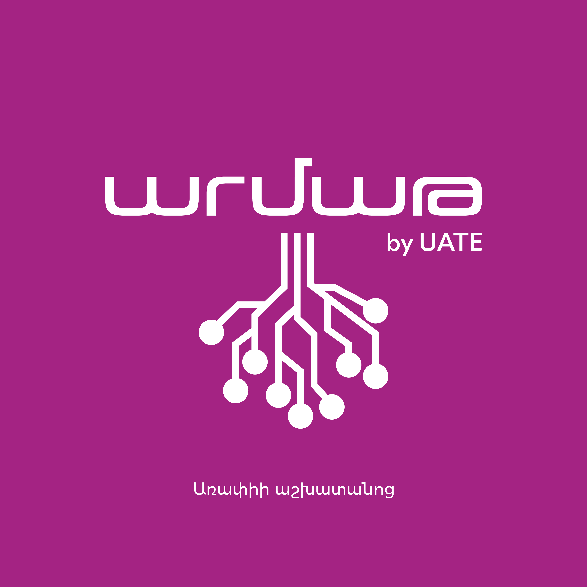

# Armath Arapi Engineering Makerspace

<div align="center">



**A state-of-the-art makerspace where engineers, makers, and innovators come together to create, learn, and transform ideas into reality.**

[](https://nextjs.org/)
[](https://react.dev/)
[](https://www.typescriptlang.org/)
[](https://tailwindcss.com/)
[](https://supabase.com/)

[Live Demo](https://armatharapi.vercel.app) · [Report Bug](https://github.com/GrishaKh/ArmathArapi-website/issues) · [Request Feature](https://github.com/GrishaKh/ArmathArapi-website/issues)

</div>

---

## About The Project

Armath Arapi is an engineering makerspace located in Arapi, Armenia. This website serves as the digital hub for our community — showcasing student projects, events, and learning materials, while providing a full-featured student portal and admin dashboard for managing the makerspace.

### Key Features

- **Bilingual Support** — Full Armenian (Հայերեն) and English language support with 400+ translation keys
- **Student Portal** — Authenticated student dashboard with materials, work submissions, progress tracking, and notifications
- **Admin Dashboard** — Student management, material assignment, work review, submission tracking, and announcements
- **Learning Materials** — Structured learning paths with progress tracking, difficulty levels, and topic categories
- **Work Submission & Review** — Students upload work, admins review with feedback and status tracking
- **Student Projects Gallery** — Showcase of innovative projects built by our students
- **Events & Achievements** — Documentation of competitions, workshops, and camps
- **Online Applications** — Student enrollment, support request, and contact forms
- **Responsive Design** — Optimized for all devices with mobile-specific UI enhancements

---

## Tech Stack

| Category | Technology |
|----------|------------|
| Framework | Next.js 15 (App Router) |
| Language | TypeScript 5 |
| Styling | Tailwind CSS 3 |
| UI Components | Radix UI + shadcn/ui |
| Animations | Framer Motion 11 |
| Content | Contentlayer (MDX) |
| Database | Supabase (PostgreSQL) |
| Authentication | bcryptjs + httpOnly session cookies |
| Email | Resend |
| Validation | Zod |
| Icons | Lucide React |
| Testing | Node.js built-in test runner |
| Deployment | Vercel |

---

## Getting Started

### Prerequisites

- Node.js 18+
- pnpm (recommended) or npm

### Installation

1. **Clone the repository**
   ```bash
   git clone https://github.com/GrishaKh/ArmathArapi-website.git
   cd ArmathArapi-website
   ```

2. **Install dependencies**
   ```bash
   pnpm install
   ```

3. **Set up environment variables**
   ```bash
   cp .env.example .env.local
   ```

   Fill in the required values:
   ```env
   # Supabase
   NEXT_PUBLIC_SUPABASE_URL=your_supabase_project_url
   NEXT_PUBLIC_SUPABASE_ANON_KEY=your_supabase_anon_key
   SUPABASE_SERVICE_ROLE_KEY=your_supabase_service_role_key
   NEXT_PUBLIC_SITE_URL=https://your-site-url.com

   # Email (Resend)
   RESEND_API_KEY=your_resend_api_key
   ADMIN_EMAIL=admin@example.com

   # Admin Dashboard
   ADMIN_PASSWORD=your_secure_admin_password
   ADMIN_SESSION_SECRET=your_long_random_session_secret

   # Student Portal
   STUDENT_SESSION_SECRET=your_long_random_student_session_secret

   # Cron Jobs
   CRON_SECRET=your_long_random_cron_secret
   ```

4. **Run the development server**
   ```bash
   pnpm dev
   ```

5. **Open [http://localhost:3000](http://localhost:3000)**

### Available Scripts

| Command | Description |
|---------|-------------|
| `pnpm dev` | Start development server |
| `pnpm build` | Build for production |
| `pnpm start` | Start production server |
| `pnpm lint` | Run ESLint |
| `pnpm typecheck` | Run TypeScript type checking |
| `pnpm test` | Run all tests |
| `pnpm test:api` | Run API tests only |
| `pnpm test:e2e` | Run end-to-end tests only |
| `pnpm content:qa` | Run content quality checks |
| `pnpm ci` | Full CI pipeline (lint + typecheck + test + build + content:qa) |

---

## Project Structure

```
├── app/
│   ├── api/
│   │   ├── admin/              # Admin API endpoints
│   │   ├── student/            # Student portal API endpoints
│   │   ├── submissions/        # Public form submissions
│   │   └── cron/               # Scheduled tasks
│   ├── admin/                  # Admin dashboard page
│   ├── events/                 # Events pages
│   ├── materials/              # Learning materials pages
│   ├── projects/               # Student projects pages
│   ├── student/
│   │   ├── login/              # Student login
│   │   └── (portal)/           # Protected portal routes
│   │       ├── materials/      # Assigned materials
│   │       ├── works/          # Work submissions
│   │       └── settings/       # Account settings
│   ├── layout.tsx              # Root layout
│   ├── page.tsx                # Home page
│   ├── sitemap.ts              # Dynamic sitemap
│   └── robots.ts               # Robots.txt config
├── components/
│   ├── sections/               # Page sections (Hero, About, etc.)
│   └── ui/                     # Reusable UI components (shadcn/ui)
├── features/
│   ├── admin/                  # Admin feature module
│   │   ├── components/         # Admin UI (dashboard, forms, panels)
│   │   ├── hooks/              # Admin state management
│   │   └── lib/                # Admin API clients
│   └── student/                # Student feature module
│       ├── components/         # Student UI (dashboard, materials, works)
│       ├── hooks/              # Student state management
│       └── lib/                # Student API client
├── content/                    # MDX content (bilingual)
│   ├── events/                 # Event posts (en/hy)
│   ├── materials/              # Learning material posts (en/hy)
│   └── projects/               # Project posts (en/hy)
├── contexts/
│   ├── language-context.tsx    # i18n context (EN/HY)
│   └── student-auth-context.tsx # Student auth state
├── lib/
│   ├── admin-auth.ts           # Admin session management
│   ├── student-auth.ts         # Student session management
│   ├── supabase.ts             # Database client & types
│   ├── translations.ts         # Translation strings
│   ├── validations.ts          # Zod schemas
│   ├── email.ts                # Resend email service
│   ├── api/                    # Shared API logic
│   ├── supabase-schema.sql     # Main database schema
│   └── student-portal-schema.sql # Student portal schema
├── hooks/                      # Shared React hooks
├── tests/
│   ├── api/                    # API unit tests
│   └── e2e/                    # End-to-end tests
├── scripts/                    # Build & QA scripts
├── public/                     # Static assets
├── types/                      # TypeScript type definitions
└── contentlayer.config.ts      # Contentlayer configuration
```

---

## Student Portal

The student portal provides an authenticated experience for enrolled students:

- **Dashboard** — Overview of progress, assigned materials, submitted works, and notifications
- **Materials** — Browse assigned learning materials, track progress (%, score, time spent), filter by status
- **Works** — Upload work submissions, view admin feedback, track review status (submitted / reviewed / needs revision / approved)
- **Settings** — Change password, view profile information
- **Notifications** — Alerts for material assignments, feedback, work reviews, and announcements

## Admin Dashboard

Admins can manage the makerspace through:

- **Student Management** — Create, edit, delete student accounts; reset passwords
- **Material Assignment** — Assign/unassign learning materials to students; bulk assignment support
- **Work Review** — Review student submissions with feedback; download uploaded files
- **Submissions** — Track and manage application, support, and contact form submissions
- **Announcements** — Send notifications to all students
- **Statistics** — Dashboard overview of student activity and submission counts

---

## Fields of Study

Our makerspace offers hands-on learning in:

| Field | Tools & Technologies |
|-------|---------------------|
| Programming | Scratch, Python, C++, JavaScript |
| Electronics | Arduino, Raspberry Pi, ESP32 |
| 3D Modeling | FreeCAD, Blender |
| 3D Printing | Slic3r, Printrun |
| Robotics | SERob Kit, Custom builds |
| CNC & Laser | HeeksCAD, bCNC |
| Vector Graphics | Inkscape |

---

## Contributing

Contributions are welcome! Please feel free to submit a Pull Request.

1. Fork the Project
2. Create your Feature Branch (`git checkout -b feature/AmazingFeature`)
3. Commit your Changes (`git commit -m 'Add some AmazingFeature'`)
4. Push to the Branch (`git push origin feature/AmazingFeature`)
5. Open a Pull Request

---

## License

This project is proprietary software for Armath Arapi Engineering Makerspace.

---

## Contact

**Armath Arapi Engineering Makerspace**

- Website: [armatharapi.vercel.app](https://armatharapi.vercel.app)
- Email: grisha.khachatrian@gmail.com
- Location: Arapi, Armenia

---

<div align="center">

**Built with passion by the Armath community**

</div>
